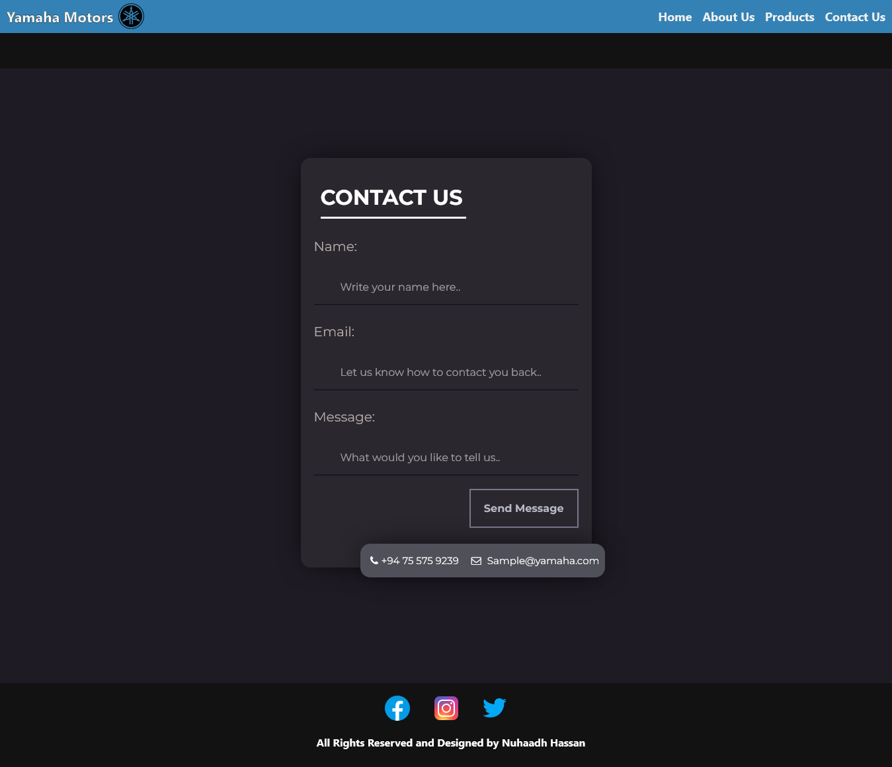

# **Simple Dark Themed Website for YAMAHA**

Created by: Nuhaadh Hassan

Date: 2023-Aug-03

## Getting Started

-   Open the index.html file in a web browser to view the website.
-   Click on the index page to open the main startup page of the website.
-   Navigate through the nav bar on the top.

## Screenshots

### Index Page


### Home Page


### Contact Us Page




## Contributing

1. Fork the repository.
2. Create a new branch:

    ```bash
    git checkout -b feature-branch
    ```

3. Make your changes and commit them:

    ```bash
    git commit -m "Description of changes"
    ```

4. Push to the branch:

    ```bash
    git push origin feature-branch
    ```

5. Create a pull request.

## License

This project is licensed under the MIT License. See the [LICENSE](LICENSE) file for details.

## Contact

For any inquiries or issues, please contact [nuhaadh9991@gmail.com](mailto:nuhaadh9991@gmail.com).
